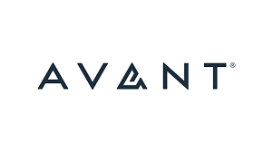

# Avant: A Northwestern Case Study

#### By Robel Arega and Mike Ryu

## 

## What is the background of your company? What do they do? Who are their competitors?

- Avant, Chicago lending company
- P2P Lending
- Avant offers access to personal loans for middle-income borrowers that need help with things like high-interest debt, home improvement, or unexpected expenses.
- There are many companies in the P2P lending space, some of Avant's competitors include LendingsClub, LightStream, and Upgrade.

---

## How does this company use technology to their advantage? Why are they considered a FinTech company?

- Users can use the Avant app or go directly online to apply for personal loans ranging from $2,000-$35,000.
- Avant is allowing it's users access to credit cards, with clear and transparent limits, ranging from $300 to $2,000, all online. This helps their userbase build credit.

- Avant's funding was fund Ycombinator start-up program. Ycombinator is an American seed company, investing in companies like Airbnb, Twitch, Dropbox, and much more.

---

## Why is this company exemplary in the FinTech space? What are their strengths and weaknesses?

- Big instutions lend their money out to individuals with good or great credit. This usually excludes middle to low income individuals or immigrants. Avant's platform allows for these excluded people access to credit.

- Since there is no brick-and-mortar location to Avant, it makes it difficult for older individual to find and access their services. Avant taking seed money from Ycombinator start up program they continue the perceived exclusion of older people from their company.

- Collecting on debt and defaults on loans will be a hurdle for Avant to climb. How much reserve does Avant have? Do they have reserves? How will they make these loans right?

---

## What is the prognosis for this company? Where do they expect to be in the future?

Avant is fast growing company, with a lot of potential to access and serve untapped users in the P2P lending space. While their future seems bright, there are still concerns of default on loans or lack of funding based on performance.
